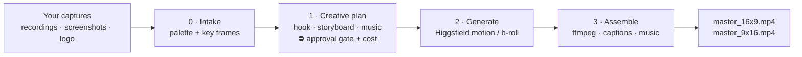

# reeljet

> **Turn your app / web / SaaS screen recordings into scroll-stopping short promo videos.**
> A [Claude Code](https://claude.com/claude-code) skill that pairs your real product footage with **[Higgsfield](https://higgsfield.ai) AI video** (Veo, Sora, Kling, Seedance, Soul), a local music library, and **ffmpeg** to auto-assemble polished ads for **Reels, TikTok, Shorts, and landing pages**.


---

## What is reeljet?

**reeljet** is an AI video ad generator that runs as a skill inside Claude Code. You point it at a folder of **real captures** of your product (screen recordings, screenshots, logo); it directs the ad, generates motion/b-roll with the **Higgsfield MCP**, scores it with music from your local library, and renders a finished `.mp4` — **master 16:9** plus a smart-reframed **9:16** vertical — with kinetic captions colored from your product's own palette.

The point isn't just stitching clips. The value is the **creative direction** — hook, narrative arc, pacing, captions, music match — produced *before* a single credit is spent, with an approval gate so you stay in control of cost.

**Good for:** indie devs and founders launching on Product Hunt / X / the App Store, SaaS marketers who need a steady stream of social ads, and anyone who wants a product demo or hype reel without opening a video editor.

## How it works



| Phase | What happens |
|------:|--------------|
| **0 · Intake** | Extracts your brand **color palette** (Pillow) and scene-detects key frames from recordings. |
| **1 · Creative plan** | Writes a shot-by-shot storyboard (`plan.json`), picks the best-matching music, estimates the Higgsfield credit cost — then **stops for your approval**. Nothing is generated until you say go. |
| **2 · Generate** | For each "generated" shot, calls the Higgsfield MCP (`generate_video` / `generate_image`) for animated screenshots, b-roll, and transitions. Idempotent — already-rendered shots are never re-billed. |
| **3 · Assemble** | ffmpeg concatenates real + generated clips, overlays kinetic captions in your palette, mixes music normalized to **−14 LUFS**, and renders 16:9 + reframed 9:16. |

### You provide vs. reeljet generates

| You provide (the substance) | reeljet / Higgsfield adds (the polish) |
|---|---|
| Screen recordings of the real UI | Animated screenshots, cinematic b-roll, transitions |
| Screenshots + logo | Color palette, kinetic captions, logo end-card/CTA |
| A one-line product brief | Hook, narrative arc, shot list, music match, the final cut |

## Quick start

```bash
# 1. Install as a Claude Code skill
git clone https://github.com/Xabilimon1/reeljet
ln -snf "$PWD/reeljet" ~/.claude/skills/reeljet

# 2. Prerequisites
brew install ffmpeg                 # libass NOT required (captions use Pillow + overlay)
python3 -m pip install pillow       # pytest too, if you want to run the tests
mkdir -p ~/reeljet/music-library   # drop royalty-free tracks named mood_120bpm_genre.mp3
                                            # (configurable — pass --library <path> to pick_music.py)
```

Connect the **Higgsfield MCP** to your agent, then in Claude Code just say:

```
/reeljet
```

…and follow the 5 phases. See [`docs/SETUP.md`](docs/SETUP.md) for details.

## Output

```
ads/<YYYY-MM-DD>-<campaign>/
├── brief.md  plan.md  plan.json  palette.json
├── frames/            # key frames from your recordings
├── generated/         # Higgsfield clips
├── captions/          # rendered caption overlays
├── master_16x9.mp4    # YouTube / landing hero
└── master_9x16.mp4    # Reels / TikTok / Shorts
```

## Features

- 🎬 **Hybrid pipeline** — your real UI footage + AI-generated motion, never faked
- 🎨 **Brand-aware** — palette extracted from your assets drives caption colors
- 🪝 **Creative direction first** — hook, arc, and storyboard before any render
- 💸 **Cost control** — credit estimate + hard approval gate; idempotent regeneration
- 📐 **Multi-format** — master 16:9 with smart blurred-background reframe to 9:16
- 🔊 **Broadcast-ready audio** — music matched by mood/BPM, normalized to −14 LUFS
- 🧱 **Portable** — captions render with Pillow + ffmpeg `overlay` (no libass needed)
- ✅ **Tested** — 29 passing unit tests over the deterministic core

## Project layout

```
SKILL.md            # the orchestration Claude Code follows (5 phases)
references/          # creative-direction, higgsfield-tools, ffmpeg-recipes, music-selection
scripts/             # deterministic, unit-tested Python
  lib/               #   palette · colorutil · musiclib · caption_render · ffmpeg_cmd · plan_schema
  *.py               #   extract_palette · extract_frames · pick_music · assemble (CLIs)
tests/               # pytest
docs/                # design spec + implementation plan
```

The deterministic logic (palette, music match, captions, ffmpeg command building, plan validation) is fully unit-tested and **independent of Higgsfield**; the AI generation is driven by Claude at runtime through the Higgsfield MCP, with `plan.json` as the single source of truth.

## Tech

Python 3 · Pillow · ffmpeg · [Claude Code](https://claude.com/claude-code) skill + MCP · [Higgsfield](https://higgsfield.ai) (Veo 3.1, Sora 2, Kling 3.0, Seedance 2.0, Soul).

## Roadmap

- Native 9:16 caption layout (currently baked into the 16:9 master)
- Optional voiceover / talking-avatar track
- AI-generated music as an alternative to the local library
- Square 1:1 export and Workflow fan-out for multi-variant batches

## License

[MIT](LICENSE) © 2026 Xabier Ariznabarreta

---

<sub>Keywords: Claude · Claude Code · Anthropic · Higgsfield · MCP · AI video generator · short-form video · Reels · TikTok · YouTube Shorts · Instagram Reels · SaaS marketing · product demo video · social media ads · ffmpeg · Veo · Sora · Kling · Seedance.</sub>
